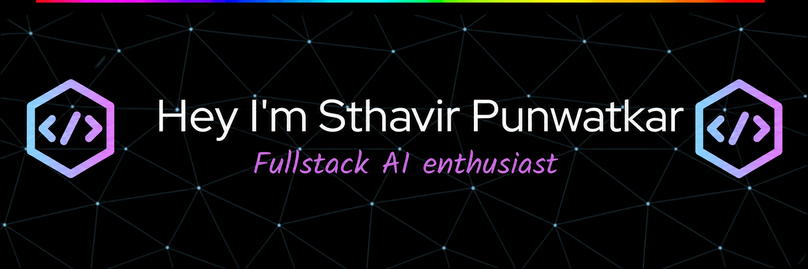
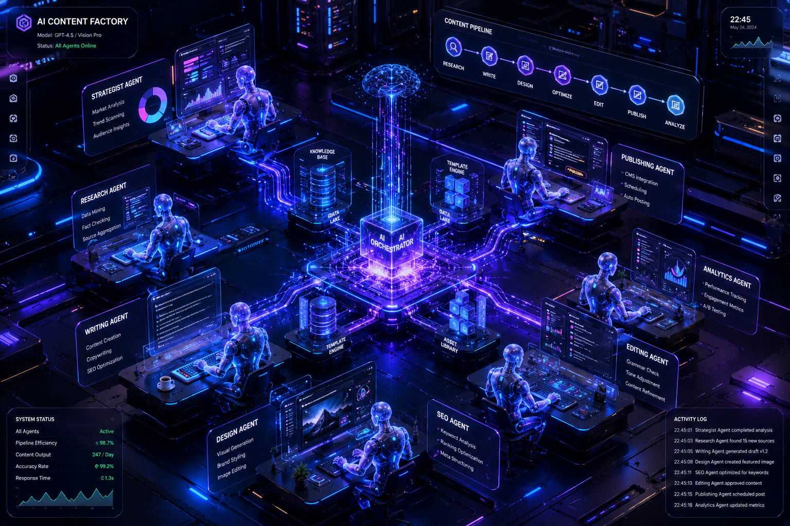

<!-- Matrix Background Animation -->

  

<!-- Greet Line -->

<!-- Animated Space Divider -->

  

<!-- Hero Banner -->

  

<!-- Intro -->
<h3 align="center">A Passionate AI Enthusiast & Full Stack Developer from India 🇮🇳</h3>

<!-- Typing Animation -->

  

---

## 🚀 About Me
- 🎓 **CS Graduate (2025)** from SKNSITS, SPPU.
- 🤖 Specialized in **Multi-Agent Workflows (LangGraph, CrewAI)** and **RAG**.
- 🚦 Built Real-Time Systems for **Railway Traffic Monitoring**.
- 📫 Reach me at: **punwatkarsthavir@gmail.com**
- 🔗 Connect on **[LinkedIn](https://www.linkedin.com/in/sthavirpunwatkar/)**

---

## 🌐 Connect with Me

  
  
  

---

## 🖥️ Tech Stack

---

## 🛠 Language and Tools

</img>

  

---

## # My Skills Set:

<table><tr>

<!-- AI & Data -->
<td valign="top" width="33%">

### AI & Data

  
    
    
    
    

</td>

<!-- Web Dev -->
<td valign="top" width="33%">

### Web Dev

  
    
    
    

</td>

<!-- DevOps -->
<td valign="top" width="33%">

### Cloud & DevOps

  
    
    
  

</td>

</tr></table>

---

## 🌟 Featured Projects

  <table border="0">
    <tr>
      <td align="center" width="50%">
        <a href="https://github.com/sthavirpunwatkar/Multi-Agent-Data-Ops-for-Content-Teams">
           
          <b>Multi-Agent Data Ops</b>
        </a>
      </td>
      <td align="center" width="50%">
        <a href="https://github.com/sthavirpunwatkar/RailwayTracker_with_neuralNetwork">
           
          <b>Railway Tracker AI</b>
        </a>
      </td>
    </tr>
    <tr>
      <td align="center" width="50%">
        <a href="[https://github.com/sthavirpunwatkar/voter-ocr-extractor](https://github.com/sthavirpunwatkar/ocr-to-extract-electoral-data)">
           
          <b>Voter OCR Extractor</b>
        </a>
      </td>
      <td align="center" width="50%">
        <a href="https://github.com/sthavirpunwatkar/SHIELD-Secure-Human-Identity-Liveness-Evaluation-Detection">
           
          <b>SHIELD Liveness Detection</b>
        </a>
      </td>
    </tr>
  </table>

---

### 🏆 Certifications

  
  
  

---

## 📊 GitHub Stats

  

  

---

  

<h3 align="center">
  
</h3>

  

  <i>"Building solutions that drive impact and inspire innovation."</i>

